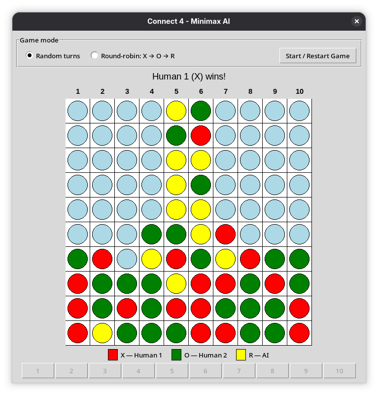
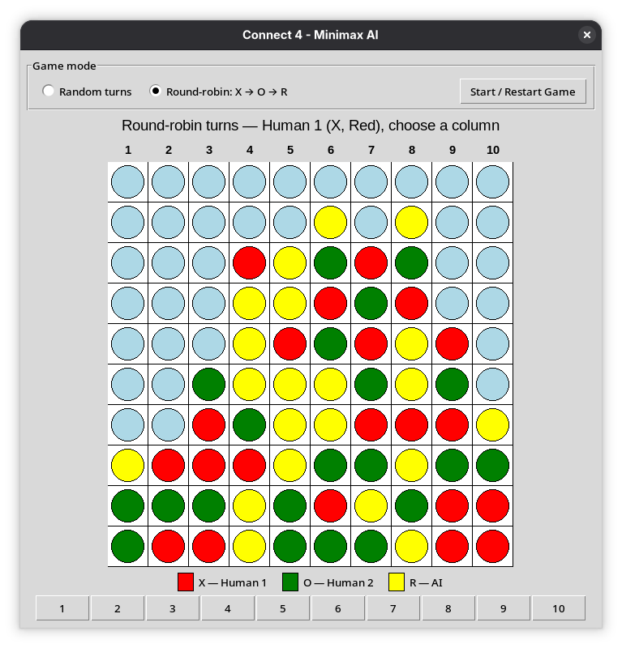

# Connect4 Minimax AI

A three-player, 10×10 Connect Four variant built to explore adversarial search using **Minimax**, **alpha-beta pruning**, and **heuristic board evaluation**.

The project includes a Tkinter interface and supports both randomized turn selection and a fixed round-robin turn order.

## Screenshots

| Random turns | Round-robin turns |
| --- | --- |
|  |  |

## Overview

Two human players (`X` and `O`) compete against a Minimax-controlled AI player (`R`) on a 10×10 board.

| Player | Role | Color |
| --- | --- | --- |
| `X` | Human 1 | Red |
| `O` | Human 2 | Green |
| `R` | AI | Yellow |

A player wins by connecting four pieces horizontally, vertically, or diagonally.

The graphical interface numbers the columns from `1` to `10`, while the internal board representation continues to use zero-based indexing.

## Game Modes

The game provides two turn-selection modes.

### Random turns

The next player is selected randomly from `X`, `O`, and `R`.

To avoid excessively long repeated turns, the same player cannot be selected more than twice in a row.

### Round-robin turns

Players move in a fixed sequence:

```text
X → O → R → X → O → R → ...
```

This mode removes turn randomness and makes the game flow easier to follow when observing the AI.

## How the AI Works

The AI controls player `R` and uses a depth-limited Minimax search with alpha-beta pruning.

The default search depth is:

```python
AI_DEPTH = 4
```

### 1. Legal move generation

Before searching, the AI finds all columns that are not full.

Candidate moves are ordered from the center of the board outward. Exploring central columns first can help alpha-beta pruning reach useful branches earlier.

### 2. Minimax search

The AI is treated as the **maximizing player**.

The two human players, `X` and `O`, are treated as adversarial **minimizing players**.

For each possible AI move, the algorithm recursively explores future positions until one of the following conditions is reached:

- the configured search depth is exhausted;
- the AI has won;
- one of the human players has won;
- the board is full.

Winning positions for the AI return positive infinity, while winning positions for either human player return negative infinity.

### 3. Heuristic evaluation

When the search reaches its depth limit without finding a terminal position, the board is scored using a heuristic evaluation function.

The evaluator examines four-cell windows horizontally, vertically, and along both diagonals.

Potential lines containing only AI pieces and empty cells increase the score. Potential lines belonging to either human player decrease it.

The current heuristic weights are:

| Pieces in a potential line | Score magnitude |
| ---: | ---: |
| 1 | 1 |
| 2 | 5 |
| 3 | 50 |

A line containing pieces from both sides is ignored because it can no longer become a four-piece winning line for a single side.

### 4. Alpha-beta pruning

Alpha-beta pruning skips branches that can no longer affect the final Minimax decision. `alpha` tracks the best score for the maximizing player, while `beta` tracks the best score for the minimizing player.

### Search Model

The AI uses a simplified adversarial search model in which both human players are treated as minimizing opponents. Turn selection is handled separately by the game loop rather than modeled inside the search tree.

## Project Structure

```text
connect4-minimax-ai/
├── main.py
├── game.py
├── ai.py
├── gui.py
├── requirements.txt
├── README.md
├── .gitignore
└── assets/
    └── screenshots/
        ├── random-turns.png
        └── round-robin.png
```

### `main.py`

Application entry point. It creates the GUI and starts the Tkinter event loop.

### `game.py`

Contains the core game state and rules:

- board representation;
- piece placement;
- winner detection;
- legal move detection;
- random turn selection;
- round-robin turn selection.

### `ai.py`

Contains the AI-specific logic:

- heuristic board evaluation;
- Minimax search;
- alpha-beta pruning;
- AI move selection.

### `gui.py`

Contains the Tkinter interface and coordinates interaction between the game state and the AI:

- board rendering;
- player colors and labels;
- column controls;
- game-mode selection;
- restart behavior;
- AI decision-time display.

## Requirements

- Python 3
- NumPy `2.3.5`
- Tkinter

Install the Python dependency with:

```bash
pip install -r requirements.txt
```


Tkinter is distributed with many Python installations, but on some Linux distributions it may need to be installed separately through the system package manager.

## Running the Project

Clone the repository and enter the project directory:

```bash
git clone https://github.com/MostafaNasrollahpour/connect4-minimax-ai.git
cd connect4-minimax-ai
```

Creating a virtual environment is recommended:

```bash
python -m venv .venv
```

Activate it, then install the dependency:

```bash
pip install -r requirements.txt
```

Run the application with:

```bash
python main.py
```

Select a game mode and press **Start / Restart Game**.

When a human player is selected, choose a column using one of the numbered buttons below the board. When `R` is selected, the AI automatically searches for a move and displays the decision time in the interface.

## Ideas to Explore

The project can be extended by experimenting with search depth, heuristic weights, alternative evaluation functions, or more advanced turn-aware search strategies.

## Project History

The project was originally built in **December 2025** to explore Minimax, alpha-beta pruning, and heuristic search in a three-player Connect Four environment.

It was revisited in **September 2026** to improve the interface, documentation, and code structure while keeping the original search logic largely intact.

## License

This project is licensed under the **MIT License**.

See the [License](LICENSE) file for details.
